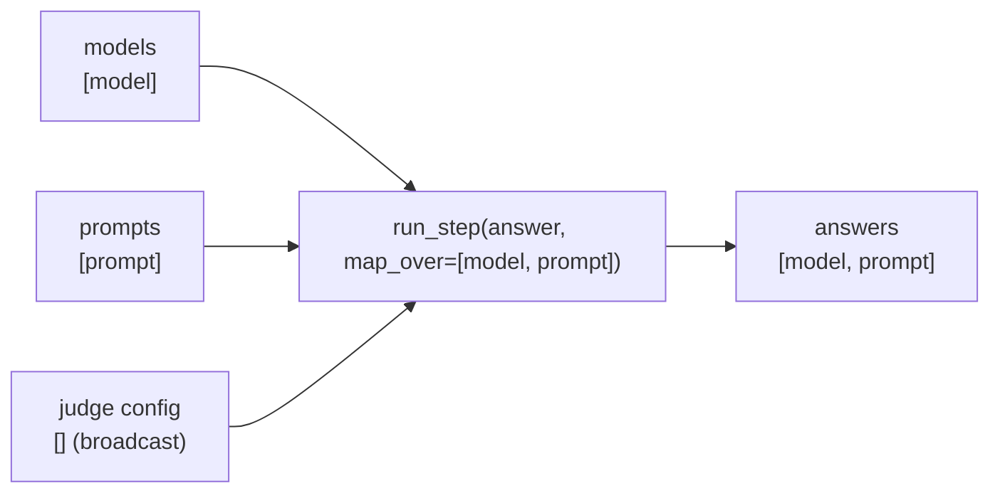

An **array** is a collection of values indexed by named **dimensions**. Every input and output of
a step or workflow is an array, and a single value is simply an array with no dimensions. Arrays
are how fxtr represents regular structures of data, and how it expresses parallel work: mapping a
step over an array's dimensions runs it once per key and stacks the results back into a new array.

If you have used xarray or a labeled dataframe, the ideas will feel familiar. If you haven't, the
picture to hold is a table whose rows are addressed by names rather than positions:

| model        | prompt   | value  |
| ------------ | -------- | ------ |
| `"baseline"` | `"math"` | `0.72` |
| `"baseline"` | `"code"` | `0.64` |
| `"variant"`  | `"math"` | `0.81` |

This array has two dimensions, `model` and `prompt`, both with string keys, and `float` values.
Its type is written `[model: str, prompt: str]: float`. The `variant` model has no `code` score,
and that is fine: arrays may be sparse. What they may not be is irregular. Every value has the same
shape, every key appears at most once, and there is one value per key.

## Structure of an array

### Dimensions

Each dimension has a name and a key type, either `int` or `str`. A row's key is the tuple of its
values along every dimension, in the array's dimension order, and no two rows share a key. Keys
don't need to form a full grid, so you can have different numbers of examples per model without
padding.

Dimension *names* are what fxtr matches on. When two arrays both have a `model` dimension, fxtr
treats them as the same axis and lines them up by key. Dimension *order* is only presentation: it
fixes how key tuples are written, and nothing else. Keep names specific and consistent across an
experiment, since the same name on two unrelated axes will make fxtr try to align them.

### Values

Every value in an array follows one **value schema**. A schema is one of:

* a primitive: `int`, `float`, `bool`, `str`, or `bytes`;
* a reference to an **[entity](entities-and-custom-types.mdx)**, a stored record with its own ID;
* a list of values of one schema;
* a struct with a fixed set of named fields, each with its own schema;
* a nullable version of any of the above, written `X | None`.

A struct-valued array looks a lot like a dataframe: the dimensions are the index, and the struct's
fields are the columns. The analogy is useful, but fxtr treats the dimensions and fields as
fundamentally different things. Dimensions address rows, must be unique for each array, and are what
steps are mapped over and what arrays are aligned on. Struct fields are part of the value; they do not
have to be unique, are not mapped over, and can be manipulated via operations like `field(...)` to
extract individual parts. (Similarly, lists inside a value are not mapped over, but can be read by
steps or SQL queries; see [Turning lists into dimensions](#turning-lists-into-dimensions).)

Regularity is enforced. Values are checked against the schema when an array is built, and a
value that doesn't fit is an error. That keeps array operations and queries simple and fast, but it
means arrays cannot hold data whose shape varies from row to row. If a row needs a tagged union, a
blob of JSON, or an object with optional parts, make that object an entity and put a reference to
it in the array. [Entities and custom types](entities-and-custom-types.mdx) explains
when to do which.

### Writing types in Python

An array type is a pair of the dimensions, written as a string, and the value schema, written as
a Python type:

```python
from typing import TypedDict

from fxtr.core.entities import BoundID


class Case(TypedDict):
    prompt: str
    expected: str


("[prompt: str]", str)                       # strings indexed by prompt
("[model: str, sample: int]", float)         # floats indexed by model and sample
("[case_id: str]", Case)                     # structs with two string fields
("[doc: str]", BoundID[Document])            # references to Document entities
("[]", int)                                  # a single int
```

A `TypedDict` describes a struct, `BoundID[T]` describes a reference to an entity of type `T`,
and `X | None` makes a value nullable. Dataclasses and other unions are not value schemas; they
belong in entities.

<Warning>
  The single-string form `"[prompt: str]: str"` is how fxtr *displays* a type. The constructors
  take the pair `("[prompt: str]", str)` and reject the display form.
</Warning>

## Creating arrays

`Array` lives in `fxtr.entity_defns.array`. The constructors take the data and the type:

```python
from fxtr.entity_defns.array import Array

prompts = Array.from_items(
    [(("greeting",), "Hello there"), (("question",), "Why is the sky blue?")],
    ("[prompt: str]", str),
)
cases = Array.from_records(
    [{"case_id": "a1", "prompt": "2 + 2", "expected": "4"}],
    ("[case_id: str]", Case),
)
budget = Array.scalar(200, int)

assert str(prompts.type) == "[prompt: str]: str"
assert str(cases.type) == "[case_id: str]: struct{expected: str, prompt: str}"
assert str(budget.type) == "[]: int"
```

* `Array.from_items` takes `(key, value)` pairs. A key is a tuple in dimension order, or a
  dictionary from dimension name to key.
* `Array.from_records` builds a struct-valued array from flat records: each record holds the
  dimension keys and the struct's fields together, the way a CSV row does.
* `Array.scalar` builds a single value.
* `infer_from_items`, `infer_from_records`, and `infer_scalar` work the type out from the data when
  that is unambiguous. An empty array always needs an explicit type.

Reading is equally direct: `array[("greeting",)]` gives one value, `array.items()` yields
`(key, value)` pairs in key order, `array.values()` yields the values, and `array.item()` gives the
one value of a scalar. Arrays are immutable once built.

### Getting data into an experiment

A workflow receives its inputs from whoever launches the job, and that launcher is the one place in
a fxtr project that may read files from disk (see
[Hermeticity](workflows-and-steps.mdx#hermeticity-and-handling-external-state)). There
are two recommended ways to get an external dataset in:

* **Construct the array in the launcher.** Read the file, validate it, build a typed array, and
  pass it to `run_job`. fxtr stores the array with the job, so the job keeps the exact data it ran
  on even if the file changes later.
* **Persist it as a project array.** A **project array** is a named, typed, editable array kept
  in the project's database. You fill it with the project client, from a script or notebook, and
  each launch takes an immutable **snapshot** to pass as an input. This suits a dataset you curate
  over time and launch many jobs against.

```python
await client.create_array("eval_cases", ("[case_id: str]", Case))
await client.replace_array("eval_cases", cases)
snapshot = await client.snapshot_array("eval_cases")
await run_job(client, experiment, {"cases": snapshot.array}, root="eval-v1")
```

Either way, key rows by stable IDs from the source rather than by row number, so that adding or
reordering rows doesn't change which cached result belongs to which row. Configuration that is
fixed in the experiment's code can go in with `context.add_source_array(...)` inside the workflow.

## Array versus ArrayHandle

Two Python types refer to arrays, depending whether the value is currently known:

* An **`Array`** contains concrete data. Arrays can be constructed in launcher code and are used
  inside steps, where every input arrives as an `Array` (or is unwrapped to a bare value, for a
  scalar).
* An **`ArrayHandle`** is a lazy reference to an array that will exist later, such as a step's
  future result. It appears inside workflows, where inputs arrive as handles and every scheduling
  operation returns a new handle.

A handle knows its type immediately. That is what lets a workflow pass handles from one step to
the next, building up a graph of dependencies, before anything has run. When a workflow does need
the data in order to do [data-dependent control flow](workflows-and-steps.mdx#data-dependent-control-flow),
`await handle.observe()` waits for the array and `await handle.item()` waits for a scalar's value.
(You should generally avoid using these just to transform data inside a workflow body; prefer to use
a step or SQL query instead.)

`handle.expect_type(("[model: str]", float))` checks a handle's type where you build it and raises
if your assumption is wrong, which is a cheap way to make a workflow's shapes readable.

## Mapping logic over arrays

Scheduling a step is one operation, `run_step`, and the same operation maps it over any number of
dimensions. `run_child_workflow` follows exactly the same rule. The `map_over` argument lists the
dimensions to map over, and the runner:

1. joins the inputs' keys along those dimensions, broadcasting any input that lacks one of them;
2. calls the function once per joint key, passing each input's slice with the mapped dimensions
   removed;
3. stacks the results into one array, whose dimensions are the mapped ones followed by whatever the
   function itself returns.



Dimensions not listed in `map_over` are **core dimensions**: they stay inside each call, and the
function receives them whole. With `map_over` left empty, which is the default, the function is
called once with the entire input arrays. Mapping is never implicit. With
[replicas](#replicas), the replica dimensions come between the mapped dimensions and the
function's own, and the function's own dimensions can't reuse a mapped or replica dimension's
name.

### Start from one call

The reliable way to design a mapped step is to write its signature for **one call**, then decide
which input dimensions should produce multiple calls. Suppose each call of `run_task` takes one
model, one task, and all the few-shot examples for its model:

| Parameter  | One call expects | Supplied array          |
| ---------- | ---------------- | ----------------------- |
| `model`    | a single `str`   | `[model]: str`          |
| `task`     | a single `str`   | `[task]: str`           |
| `examples` | `[example]: str` | `[model, example]: str` |

```python
# models:   [model: str]: str
# tasks:    [task: str]: str
# examples: [model: str, example: int]: str
results = context.run_step(
    "run_tasks",
    run_task,
    {"model": models, "task": tasks, "examples": examples},
    map_over=["model", "task"],
)
# One call per (model, task); each call sees its model's [example] slice.
# If run_task returns a float, the result is indexed by the mapped dimensions:
results.expect_type(("[model: str, task: str]", float))
```

In this call:

* `model` and `task` have no dimensions in common, so they cross: two models and three tasks make
  six calls.
* `examples` shares the `model` dimension, so each call receives the `[example]` slice for
  its own model (with this same slice used for all tasks). Different models may have different numbers of examples, which are then given directly to the step function.
* The `[model, task]` dimensions are prepended to the dimensions of the step's result. (If the step returns a scalar, the result will have just these two dimensions.)

It's important to distinguish between **mapping** a step over inputs and **passing the whole
set** to one call. Mapping `count_words` over `prompt` gives one call per prompt and a result
indexed by prompt. Passing the whole `[prompt]` array to `mean_length` with no `map_over` gives one
call that sees every prompt and returns one number. A reduction is just a step whose signature
keeps the dimensions it reduces over as core dimensions:

```python
@step(name="eval.mean_score")
async def mean_score(
    context: StepContext,
    scores: Annotated[Array[float], "[task: str, sample: int]"],
) -> float:
    """Average a model's scores across tasks and samples."""
    values = list(scores.values())
    return sum(values) / len(values)


# scores: [model: str, task: str, sample: int]: float
per_model = context.run_step("mean_scores", mean_score, {"scores": scores}, map_over=["model"])
# Mapping over model leaves [task, sample] as the core dimensions each call receives.
per_model.expect_type(("[model: str]", float))
```

Each call receives one model's `[task, sample]` scores, and `per_model` has type `[model]: float`.

### Alignment rules

Inputs line up by dimension name and key:

* Inputs that share a dimension align by key. (If two independent axes happen to
  share a name, rename one with `handle.rename({...}).collect()` first.)
* An input lacking a mapped dimension is broadcast along it. A scalar is broadcast to every call.
* Inputs with entirely disjoint dimensions become a cross product (since each input is broadcast across all of its missing dimensions).

By default (with `join="exact"`), inputs fail to align if doing so would drop any input's key, so a missing row is an
error rather than a silent skip. Sparse arrays are still allowed as long as every input agrees on which keys it
has. You can choose to instead use an inner join by passing `join="inner"`, which only runs the step for keys that are present in all inputs (after broadcasting).

### Selecting parts of an input

`handle.field("name")` selects one field of a struct-valued array while keeping its dimensions.
This is the usual way to pass pieces of a dataset to a step that expects simple values:

```python
# cases:        [case_id: str]: Case     (a struct with prompt and expected fields)
# judge_config: []: BoundID[JudgeConfig]  (a scalar, broadcast to every call)
questions = cases.field("prompt").collect()
questions.expect_type(("[case_id: str]", str))  # the field, still keyed by case_id

answers = context.run_step(
    "answer",
    answer,
    {"question": questions, "config": judge_config},
    map_over=["case_id"],
)
answers.expect_type(("[case_id: str]", BoundID[Answer]))
```

Because the field keeps the dataset's `case_id` keys, the result lines up with the dataset and
with anything else derived from it. The same trick, combined with a query, is how you run a step
over only some of the inputs (see
[Running a step over a subset of the inputs](#running-a-step-over-a-subset-of-the-inputs)).
`collect()` is explained in
[Querying, filtering, and aggregating arrays](#querying-filtering-and-aggregating-arrays).

### Replicas

`replicas={"sample": range(3)}` repeats each call three times with the same inputs, under
distinct cache addresses, so the three calls are independent samples. The result gains a `sample`
dimension after the mapped ones. The step body does not see the replica number, so `replicas` usually
makes sense when the step is fundamentally nondeterministic. (If a step needs a random seed, pass seeds
as an ordinary input array and map over its dimension.)

## Querying, filtering, and aggregating arrays

Between steps you often need to filter, reshape, aggregate, or join arrays. fxtr has a **query
builder**, a set of methods such as `filter`, `select`, `aggregate`, and `join`, and an SQL entry
point, `fxtr.sql(...)`, for anything the builder doesn't express. Both describe a query lazily, and
`collect()` runs it. Queries are executed by DuckDB, so they are fast on large arrays.

The same methods work on an `Array` and on an `ArrayHandle`, with one difference in what
`collect()` does:

* **On arrays** (in a step, a launcher, or a notebook), `await query.collect()` runs the query now
  and returns an `Array`.
* **On handles** (in a workflow), `query.collect()` is not awaited. It adds the query to the
  workflow's graph as a **query node**, which the runner computes when its inputs are ready, and
  returns a handle to it. The rows never pass through the workflow body.

```python
from typing import TypedDict

from fxtr.entity_defns.query import count, dim, value


class Run(TypedDict):
    score: float
    error: str | None


class Summary(TypedDict):
    runs: int
    mean_score: float | None  # mean() of no rows is null, so the field is nullable


# In a workflow, with `runs` a handle of type [model: str, run: int]: Run.
# Keep the runs that finished, then summarize each model. Nothing runs here.
finished = runs.filter(value().field("error").is_null()).collect()
finished.expect_type(("[model: str, run: int]", Run))  # a filter keeps the dimensions

per_model = finished.aggregate(
    {"runs": count(), "mean_score": value().field("score").mean()},
    group_by={"model": dim("model")},
).collect()
per_model.expect_type(("[model: str]", Summary))  # group_by names become the dimensions

# In a step, with `runs` an Array of the same type: the same query, run now.
summary = await runs.filter(value().field("error").is_null()).aggregate(
    {"runs": count(), "mean_score": value().field("score").mean()},
    group_by={"model": dim("model")},
).collect()
assert str(summary.type) == "[model: str]: struct{mean_score: float?, runs: int}"
```

`dim("model")` reads a dimension key, `value()` reads the row's value, and `value().field("x")`
reads a field of a struct value. Predicates use `&`, `|`, `~`, `is_in`, and `is_null` rather than
Python's `and`, `or`, `not`, and `in`, and they follow SQL's rules about nulls. `fxtr.sql` takes a
DuckDB `SELECT` over named tables, each of which has a `dims` column and a `value` column.

### Running a step over a subset of the inputs

A common need is to run a step over some of a dataset rather than all of it: only the hard cases,
only the pairs of model and harness that make sense, only the rows that survived an earlier
filter. The pattern has three parts, and it works because queries and field selection both keep
the array's dimension keys:

1. **Keep the inputs together in one struct-valued array.** Each row holds everything the step
   will need for that key, as fields.
2. **Select the rows with a query.** Filter the handle, or build an array holding only the
   allowed keys. The result has the same dimensions and fewer rows.
3. **Map the step over the selected rows, passing the fields it needs with `.field()`.** The
   fields keep the selected keys, so the join produces exactly those calls.

Suppose `Case` also has a `difficulty` field, and only the hard cases should be answered:

```python
# cases: [case_id: str]: Case, with fields prompt, expected, and difficulty
hard = cases.filter(value().field("difficulty") == "hard").collect()
hard.expect_type(("[case_id: str]", Case))  # fewer rows, same dimensions

answers = context.run_step(
    "answer_hard",
    answer,
    {"question": hard.field("prompt").collect(), "config": judge_config},
    map_over=["case_id"],
)
answers.expect_type(("[case_id: str]", BoundID[Answer]))  # one row per hard case
```

The same pattern restricts which **combinations** run. Passing a `[model]` array and a
`[harness]` array to a mapped step runs every pair. To run only some pairs, first build the full
grid as one struct-valued array with `context.combine`, then filter it. Here each model and each
harness records its provider, and only cross-provider pairs should run:

```python
# models:    [model: str]: ModelInfo      (fields name and provider)
# harnesses: [harness: str]: HarnessInfo  (fields name and provider)
pairs = context.combine({"model": models, "harness": harnesses})
# combine broadcasts each input along the dimension it lacks, giving the full grid:
#   [model: str, harness: str]: struct{model: ModelInfo, harness: HarnessInfo}

allowed = pairs.filter(
    value().field("model").field("provider") != value().field("harness").field("provider")
).collect()
# Same dimensions, only the rows where the predicate holds.

results = context.run_step(
    "run_allowed",
    run_task,
    {
        "model": allowed.field("model").field("name").collect(),      # [model, harness]: str
        "harness": allowed.field("harness").field("name").collect(),  # [model, harness]: str
        "task": tasks,                                                # [task]: str
    },
    map_over=["model", "harness", "task"],
)
results.expect_type(("[model: str, harness: str, task: str]", float))  # allowed pairs × tasks
```

Both selected fields carry the joint `(model, harness)` keys of the filtered grid, so the join
produces the allowed pairs crossed with the tasks and nothing else. If another input, such as
per-model examples, has rows for models that end up unselected, pass `join="inner"` so those rows
are dropped rather than reported as missing. When the allowed pairs are an explicit list rather
than a rule, build them in the launcher with `Array.from_records` over the joint keys and pass
them in as an input; the selection step is the same from there.

When the selection depends on earlier results, compute it with a query over those results'
handles, or in a step that takes them. Don't observe the results, choose rows in Python, and add
the choice back as a source array: the viewer would lose the edge from the results to the
selection. Because a query node isn't a step, selecting this way costs nothing in the cache, and
the query shows up in the viewer as part of the argument that reads it.

### Turning lists into dimensions

Sometimes a step returns a struct that contains a list. For example, an extraction step might read
each answer and return a summary together with the list of claims the answer makes:

```python
class Extraction(TypedDict):
    summary: str
    claims: list[str]
```

The step's result has type `[answer: str]: Extraction`. The next step must check each claim on
its own, so it must be mapped over the claims, but the claims are inside a list, not a dimension.
We can solve this with a SQL query that selects the `claims` field and unnests it: `unnest`
gives one row per element, and `generate_subscripts` gives each element's position, which becomes
the new dimension's key:

```python
# extractions: [answer: str]: Extraction
claims = fxtr.sql(
    """
    SELECT {answer: dims.answer, i: generate_subscripts(value.claims, 1) - 1} AS dims,
           unnest(value.claims) AS value
    FROM extractions
    """,
    tables={"extractions": extractions},
    output_type=("[answer: str, i: int]", str),
).collect()
claims.expect_type(("[answer: str, i: int]", str))  # one row per claim
```

Now a step can be mapped over `answer` and `i`, and the `answer` dimension connects each claim back to
its extraction. To fold a dimension back into a list, you can use `list(value ORDER BY dims.i)` with a
`GROUP BY` on the dimensions that remain. (The query builder has no `unnest`, so this is one of
the places where you need SQL.)

<Warning>
  Query nodes are not cached: the runner recomputes them whenever a job resumes and in every
  later job. That is harmless for deterministic queries. It is not for SQL that asks for varying
  values, such as `random()` or `now()`, and it can be a problem for summing floating-point values
  whose order of summation is not fixed. Put random draws, timestamps, and sensitive floating-point
  aggregations in steps, whose results are cached, rather than in workflow queries.
</Warning>

The full set of operations, the places where queries differ from Python, and more worked
examples are in the [array query reference](../reference/array-queries.mdx).
