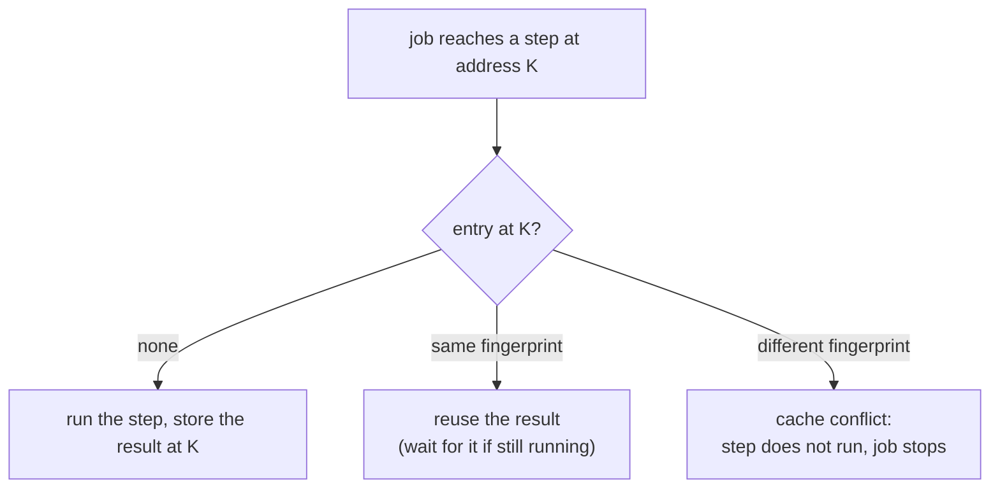

Every step's result is stored in the project's **step cache**. A later job that asks for the
same step on the same inputs reuses the result instead of running the step again, which
makes a fxtr experiment cheap to iterate on. You can edit the workflow to widen a sweep, add a
new analysis step, or fix a bug downstream, then launch a new job and pay only for the work that is
actually new. Your experiment code never has to manage data versions or check whether a result
already exists; it describes what should be computed, and fxtr uses the cache to determine what
values you already have.

The cache is also where fxtr is deliberately conservative. By default, if a step requested by a job
doesn't match the cached result, the job is *interrupted* and the conflict must be manually cleared,
in case this change was unintentional. This page describes how to understand these cache conflicts
and how to clear them.

## Mental model

Four facts describe the cache:

* **Every step invocation has a cache address.** Within one job, a cache address always resolves
  to exactly one value. By default each invocation a workflow schedules gets a unique address built
  from its position in the job, so you rarely need to think about addresses unless you want more control
  over how results are shared between jobs.
* **Every invocation also has a fingerprint:** the step's registered name together with the exact
  input data it received. Two invocations with the same fingerprint would compute the same thing
  (or, for a nondeterministic step, a sample of the same thing).
* **There is one shared, mutable cache for the whole project**, keyed by address. Every job in
  the project's database schema reads and writes it. Separately, **each job keeps its own
  immutable record** of which result it took at each address. Clearing or overwriting a cache
  entry later never changes what a finished job used.
* **A lookup compares fingerprints.** When a job reaches a step, it looks at the entry at the
  step's address:



A **cache conflict** means the address already holds a result computed from different inputs, or
by a step with a different name. Reusing it would give a wrong answer; replacing it would destroy
work some other job may depend on. So by default the job stops once nothing else can proceed, and
reports the conflicting addresses with the commands that resolve them. Nothing is lost: every step
that could run has run, and the job can be resumed once you have decided what to do.

A failed or abandoned entry (from a step that raised or a process that died) is not a conflict.
The next job to ask for that address simply runs the step.

## Cache addresses

Every operation in a job has a **pathname**, a readable address built from the names you give
things. The root workflow's pathname is the `root` you pass when launching the job, `"root"` by
default. Each step, child workflow, and source array adds its local name under its parent, which
must be unique within that parent, and a mapped or replicated invocation adds its keys, written as
JSON values in dimension order:

| Pathname                                    | Refers to                                                             |
| ------------------------------------------- | --------------------------------------------------------------------- |
| `qa-v1`                                     | The root workflow of a job launched with `root="qa-v1"`               |
| `qa-v1/answer[model:"small",prompt:"math"]` | One invocation of the `answer` step, mapped over `model` and `prompt` |
| `qa-v1/summarize[model:"small"]/mean`       | An unmapped step inside a mapped child workflow                       |
| `qa-v1/sample[prompt:"math",sample:2]`      | A step invocation with a replica key                                  |

A step's pathname is its default cache address. That has two consequences worth internalizing:

* **Two jobs share results when their pathnames match.** The same `root`, the same local names
  along the way, and the same mapped keys give the same address. Rename a step in the workflow,
  move it into a child workflow, or change a dimension's name, and its results get new addresses,
  so the next job computes them afresh.
* **The root name is a namespace.** Because every address starts with `root`, keeping the root the
  same across launches is how you reuse results, and changing it is how you start from a clean
  slate without touching anything. A new root is the simplest way to draw fresh samples from a
  nondeterministic step, since the job ID is not part of the address and a new job under the old
  root would reuse the old samples. To draw fresh samples on every launch, generate the root in
  the launcher, as in `root=f"qa-{uuid.uuid4()}"`, and never inside a workflow.

Names are not escaped, so never put `/`, `[`, or `]` in a local name, and make names specific:
`comparison_judge_config` reads better in an address than `config`.

### Customizing an address

Occasionally you want a step's results to be shared under an address that does not follow from
its position, for example a slow preprocessing step whose results several experiments should
share whatever their roots are. `run_step` and `run_child_workflow` take an
`override_cache_address_prefix` argument that replaces the pathname-derived prefix. Mapped and replica
keys are still appended to it, and a child workflow passes its prefix down to everything beneath
it.

```python
clusters = context.run_step(
    "cluster_transcripts",
    cluster_transcripts,
    {"transcripts": transcripts},
    override_cache_address_prefix="shared/clusters-v1",
)
```

Within a single job, an address must resolve to a single value. If two invocations in one job end
up at the same address with identical inputs, the step runs once and both use the result. If they
arrive with different inputs, that is an error in the workflow (`CacheAddressReuseError`), which almost
always means two scheduled runs were given the same override prefix.

## Clearing the cache

`fxtr cache list` shows the cache, and `fxtr cache clear` forgets entries so that the next job to
ask for them runs the steps afresh. Jobs that already used a cleared result keep it.

```bash
uv run fxtr cache list                                   # everything
uv run fxtr cache list 'qa-v1/answer[model:*,prompt:*]'  # a pattern: * matches any key value
uv run fxtr cache clear qa-v1/answer                     # an address and everything under it
uv run fxtr cache clear --all --step qa.answer           # every entry a given step computed
uv run fxtr cache clear --all                            # the whole cache
```

A pattern is an address in which a mapped key's value is `*`. Give every key of the group, in the
address's order, and quote the pattern in the shell. A `*` anywhere else is refused, since it
doesn't mean what it would in a shell glob. `--step NAME` narrows any selection to the
entries one step computed, and `--state` to entries in one state. From Python, the project client
has `list_cache_entries` and `clear_cache_entries`, taking `prefix=`, `addresses=`, or `conflicts_in=`.

### Resolving a job's conflicts

When a job stops on cache conflicts, `fxtr jobs status JOB` groups them into patterns and prints
the commands that fix them:

```text
job 3fa3df92-…: stopped
  reason: cache conflicts at 2 addresses, such as 'qa-v1/answer[model:"small",prompt:"math"]': different requests own them; clear them to run these requests there
  cache conflicts at 2 addresses:
    qa-v1/answer[model:"small",prompt:*]  2 of 3 entries  qa.answer
  to list them:          fxtr cache list --conflicts-in 3fa3df92-…
  to clear them:         fxtr cache clear --conflicts-in 3fa3df92-…, then fxtr resume 3fa3df92-…
  to rerun overwriting:  fxtr resume 3fa3df92-… --overwrite-cache-conflicts
```

Each pattern is followed by how many of the entries it matches are in conflict, and the step that
owns them: "2 of 3 entries" means the pattern also matches one entry that is not. From
Python, `status.cache_conflicts` lists every conflict as a `CacheConflict`: its `cache_address`,
the `step_name` of the request that owns the entry, and its `kind`, `"completed"` for a result or
`"running"` for an attempt in progress.

There are three ways forward, and they suit different situations:

<Tabs>
  <Tab title="Clear and resume">
    Clear exactly the job's conflicts, then resume. You see each conflict before it goes.

    ```bash
    uv run fxtr cache list --conflicts-in 3fa3df92-…
    uv run fxtr cache clear --conflicts-in 3fa3df92-…
    uv run fxtr resume 3fa3df92-…
    ```

    This is the safest approach and is recommended when you want to avoid clearing expensive work.
    A downstream step's inputs only change once the steps before it have rerun, so it may conflict
    on the resume, and a pipeline of several stages can take a few rounds.
  </Tab>

  <Tab title="Overwrite">
    Resume with `--overwrite-cache-conflicts`. Every conflicting step runs and replaces the old
    result, as if you had cleared it first. Steps downstream whose inputs change as a result
    conflict in turn and are overwritten by the same resume; steps whose inputs come out the same
    reuse their results. The flag applies to that one run. `fxtr run` takes it too, and from
    Python, `client.submit`, `client.run`, `client.resume`, `run_job`, and `launch_cli` take
    `overwrite_cache_conflicts=True`.

    ```bash
    uv run fxtr resume 3fa3df92-… --overwrite-cache-conflicts
    ```

    This can be a useful choice while you are iterating on data or settings on purpose and the old
    results are no longer wanted.
  </Tab>

  <Tab title="New root">
    Launch again under a new `root`. Every address is fresh, every step runs, and every earlier
    result stays exactly as it was. Choose this when the old results are still valuable and you may
    want to re-run the original workflow with its original inputs.
  </Tab>
</Tabs>

Neither overwriting nor clearing touches an entry whose step another job is running at that
moment. Wait for that job, or cancel it, and resolve the conflict afterwards.

### Reusing another job's results

Clearing the cache does not mean that the data is lost!
Every job maintains an immutable record of the exact step results that were used when it ran.
If you want to restore the cache to a previous state, you can **adopt** the cache entries that
were recorded in any of the jobs in the database using the command `fxtr cache adopt JOB`. This
puts the results a job took back into the cache at their addresses, so later jobs reuse them.

You can also use this to import parts of the cache from a separate copy of the experiment database
(e.g. from a collaborator's copy). The command `fxtr jobs import FILE --adopt-cache` both makes the
imported job available and adopts all of its cache entries so that they are used by local jobs.

## Handling changes to step logic

fxtr tracks the exact version of code used to run any given step, and associates it with the cache
entry. However, the step fingerprint only covers a step's **name** and
**inputs**, not its code.
Editing a step's body and launching under the same root reuses the cached results even if they are
tagged as generated by an older code version.

This is a deliberate choice, since it is difficult to predict what code changes can affect behavior,
and it is often useful to significantly refactor code without invalidating previous results. We choose
to simply *track* the differing code versions, and allow users to directly control whether or not
their changes should invalidate the cache.

To make sure that code changes do not lead to invalid results in the cache, we recommend following one of
the following two best practices.

### Iterating on step logic during development

While you are first writing a step, you will often make several breaking changes in a row. After each
breaking change, you can clear the cache for that step so the next job does not pick up a stale result:

```bash
uv run fxtr cache clear --all --step qa.answer
```

<Tip>
  To keep trial runs apart from real results, you can also point the project at a scratch database schema
  while experimenting: set `schema` in `fxtr.local.toml` to another name, and set it back for
  real runs. See [Before you launch](../guides/running-and-viewing-jobs.mdx#before-you-launch).
</Tip>

### Adding configuration to stable steps

Once a step's logic has stabilized and real results depend on it, or once you have shared your
code with collaborators, you should generally avoid changing its behavior in
place. A change in place forces you to remember to clear the cache and to track which version of
the code produced each result, and the system cannot protect you if you forget. Instead:

* **To change or extend what a step does, add a configuration argument** rather than editing the
  logic. Give the new argument a default that preserves the old behavior. Existing results keep
  matching, because their inputs are unchanged, and new results computed with the new option have
  different fingerprints and so can never be confused with old ones.
  (You can also bundle configuration arguments into a [config entity](entities-and-custom-types.mdx),
  and handle configuration changes by adding a field to that entity.)
* **If the change is too large for a flag, give the step a new name**, for example by adding a
  version suffix: `qa.answer` becomes `qa.answer_v2`. The new name gets fresh cache entries, old
  results stay intact and attributable, and jobs that still reference the old step continue to
  work.

The same reasoning applies to anything that influences a result: model IDs, prompts, sampling
settings, dataset contents. Pass them in as inputs, and the fingerprint tracks them for you. A step
that read a prompt template from a module constant would have the same fingerprint even if the
constant changed, and that is exactly the situation the cache cannot detect.
