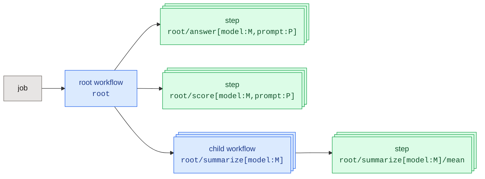

In a fxtr project you launch **jobs**, and each job executes one **workflow**. A workflow
describes the structure of an experiment: which computations to run, on which data, in what
order. It does not do the expensive work itself. Instead it schedules **steps**, and a step is
where the expensive or nondeterministic computation happens: sampling a model, judging an answer,
drawing a random number, crunching a large array.

A job is therefore a tree: one root workflow, which schedules steps and child workflows, which in
turn schedule steps. All the work happens at the leaves.



Workflows are required to be functionally pure and deterministic: given the same inputs and the
same step results, a workflow must make the same decisions. That property is what lets fxtr
rebuild a job's graph by replaying the workflow, resume a job after an interruption, and check that
nothing changed under it.

Steps, on the other hand, are allowed to be nondeterministic, and may involve expensive work such
as querying a language model. Fxtr executes each step once and saves its result in the **step cache**,
so that previously computed results can be re-used.

## Workflows

A workflow is an async Python function decorated with `@workflow`. It receives a context and a set
of named inputs, and it returns a result. Its inputs and result are **arrays**, collections of
values indexed by named dimensions, which
[Arrays and parallel computations](arrays-and-parallel-computations.mdx) covers in
depth. Inside the workflow you mostly do not touch the arrays' data. You work with
**handles** to them, and you pass those handles between the operations you schedule.

Here is a workflow that scores a set of prompts with a model, then asks a child workflow to
summarize the scores:

```python
from typing import Annotated

from fxtr.experiment.handles import ArrayHandle
from fxtr.experiment.workflows import WorkflowContext, workflow


@workflow(name="qa.evaluate")
async def evaluate(
    context: WorkflowContext,
    prompts: Annotated[ArrayHandle[str], "[prompt: str]"],
    models: Annotated[ArrayHandle[BoundID[ModelConfig]], "[model: str]"],
) -> Annotated[ArrayHandle[float], "[model: str]"]:
    """Answer every prompt with every model and summarize each model's scores."""
    answers = context.run_step(
        "answer", answer, {"config": models, "question": prompts}, map_over=["model", "prompt"]
    )
    scores = context.run_step("score", score, {"answer": answers}, map_over=["model", "prompt"])
    return context.run_child_workflow("summarize", summarize, {"scores": scores}, map_over=["model"])
```

Three things are happening:

* `context.run_step(name, step, inputs, ...)` schedules a step and immediately returns a handle to
  its future result. It does not wait. The `map_over` argument says which dimensions to run the
  step once per key of, so `answer` is called once for every model and prompt pair.
* Passing the `answers` handle to the `score` step is what makes `score` depend on `answer`. fxtr
  draws an edge between them in the viewer, and will not start `score` until the answers exist.
* `context.run_child_workflow(...)` works the same way for a workflow. Any workflow can be the root
  of a job, and any workflow can be a child of another, so you can compose an experiment out of
  reusable parts.

When the body returns, the workflow's job is done: it has described a graph. The runner then
works through the graph, running each step whose inputs are ready, until every result exists.

### Determinism

fxtr runs a workflow body more than once. It replays the body to resume a job after a crash, and
by default it also runs the body a second time at the end of every attempt to verify that the body
made the same decisions. A workflow must therefore be cheap and deterministic:

* Do anything expensive, random, or dependent on the outside world in a step.
* Never generate random numbers, UUIDs, or timestamps in a workflow.
* Give every scheduled operation a stable name. Names are how fxtr matches a replayed operation
  with the recorded one.
* Fix datasets and settings before the job starts and pass them in as inputs.

If a replayed body builds a different graph under the same names, the attempt fails with a
`DeterminismError` rather than silently continuing with a mismatched record.

<Note>
  Workflow determinism is only required within a single job. If you change your workflow code, you can simply start a new job to execute it from scratch. The step cache is shared across jobs, so this still allows you to re-use expensive work.
</Note>

### Handles

A handle (`ArrayHandle`) is a reference to an array that may not have been computed yet. Its
**type**, the dimensions and the kind of value it holds, is known the moment you receive it, because
fxtr derives the type of every operation from the types of its inputs. That is why the workflow
above can pass `answers` to the next step before any model has been called: the type checks
happen while the graph is being built, and a mismatch is an error at scheduling time rather than
after an hour of sampling.

You can also ask a handle for its data, with `await handle.observe()` for the whole array or
`await handle.item()` for a single value. This pauses the workflow until the result exists, and it
is how a workflow makes a data-dependent decision (see
[Data-dependent control flow](#data-dependent-control-flow)).
Mapping a step over a handle's dimensions, and the other ways of combining handles, are covered in
[Arrays and parallel computations](arrays-and-parallel-computations.mdx#mapping-logic-over-arrays).

## Steps

A step is where the real work happens. It is an async function decorated with `@step` that
receives concrete data, computes something, and returns a result. Model calls, LLM judges,
simulations, external API queries, random sampling, and heavy numerical work all belong in steps.
So does any deterministic transformation whose result you want cached or whose place in the graph
you want to see in the viewer.

Here is a step that asks a language model one question, using the
[behaviors](../../../behaviors/references/index.mdx) library:

```python
import anyio
from behaviors.implementations.models import (
    DEFAULT_FAILURE_CATEGORIES_TO_RETRY,
    generate_with_retries,
)
from behaviors.implementations.models.openai_responses import OpenAIResponsesAPI
from behaviors.types import ContentText, ModelCallFailure, ModelRequest, RetryConfig, UserMessage

from fxtr.experiment.steps import StepContext, step


@step(name="qa.answer")
async def answer(context: StepContext, config: ModelConfig, question: str) -> Answer:
    """Ask the model one question and keep its reply."""
    request = ModelRequest(
        context=(UserMessage(content=(ContentText(text=question),)),),
        tools=(),
        tool_choice=None,
        parallel_tool_calls=None,
        sampling=config.sampling,
    )
    api = OpenAIResponsesAPI(config.model_name)
    try:
        response = await generate_with_retries(
            api, request, retry=RetryConfig(),
            failure_categories_to_retry=DEFAULT_FAILURE_CATEGORIES_TO_RETRY,
        )
    finally:
        with anyio.CancelScope(shield=True):
            await api.aclose()
    if isinstance(response, ModelCallFailure):
        raise RuntimeError(f"model call failed ({response.category}): {response.description}")
    return Answer(question=question, text=answer_text(response.output))
```

`ModelConfig` and `Answer` are entity types the project defines (see
[Entities and custom types](entities-and-custom-types.mdx)), and `answer_text` is a
small helper that joins the text blocks of the reply. The details of building requests, holding
multi-turn conversations, and judging outputs are in
[Calling language models](../../../behaviors/references/guides/language-models.mdx).

### How steps run and get cached

To run a step, schedule it from a workflow with `context.run_step`. Scheduling gives the
invocation an **address** in the job and records what inputs it received, and it is what connects
the step to the cache, to the viewer, and to the job's record. (Don't call the step function
directly from your own code, this will not be tracked by fxtr!)

Before running a step, fxtr looks at that address in the project's **step cache**. If a result
computed by the same step from the same inputs is already there, the job simply
reuses the result. If there is no result there, the step runs and its result is stored at the address. This is what
lets you edit a workflow, launch it again, and pay only for the new work. When the cache holds a result computed
from *different* inputs, the job either pauses for review or overwrites the cache, depending on the configuration.
[Managing the step cache](managing-the-step-cache.mdx) explains this in more detail.

### Failures: return or raise?

A step that raises an exception is treated as having hit a **transient** problem. Its attempt
fails, nothing is cached, work that does not depend on it keeps going, and the job ends without
succeeding. When you resume the job, the step runs again. This is the right behavior for a network
error, a rate limit that outlasted the retries, or a crashed subprocess.

A step that **returns** a value is treated as having succeeded, and its result is cached like any
other, even if that result records an error. So the rule is:

* **Return** for an outcome every attempt would reproduce: an input with nothing to grade, a reply
  that did not contain the expected answer, a conversation that hit the context limit. Represent the
  outcome in your result type, for example with a nullable score or an error field.
* **Raise** for a failure a later attempt might not hit.

<Note>
  Caching does not make side effects happen exactly once. An attempt that is interrupted after it
  sent a request but before its result was saved will run again when the job resumes.
</Note>

### Steps should be pure, even if nondeterministic

A step may be nondeterministic. Two samples from the same model with the same prompt differ, and
that is fine, because fxtr records whichever one the step returned and never recomputes it. But a
step should still be **functionally pure**: its result should depend only on its inputs, plus the
external services it calls through stateless APIs. It should not read files from the machine it
happens to run on, consult environment-specific state, or write anything anywhere except through
its return value and the entities it stores. The reasons are spelled out in
[Hermeticity](#hermeticity-and-handling-external-state) below.

## Contexts and signatures

### Signatures

Every step and workflow has a **signature**: the array type of each input and of the result. fxtr
reads it from the function's type annotations. A few conventions cover most cases:

| Annotation                                     | Means                                                                      |
| ---------------------------------------------- | -------------------------------------------------------------------------- |
| `question: str`, `-> float`                    | A single value. The step body receives and returns the bare value.         |
| `Annotated[Array[float], "[sample: int]"]`     | A concrete array with a `sample` dimension. Used in steps.                 |
| `Annotated[ArrayHandle[str], "[prompt: str]"]` | A handle to an array with a `prompt` dimension. Used in workflows.         |
| `ScalarHandle[int]`                            | A handle to a single value. Short for `Annotated[ArrayHandle[int], "[]"]`. |

The string inside `Annotated` names the dimensions, which no Python type can express on its own.
`Array[T]` or `ArrayHandle[T]` alone says what the values are but not what the dimensions are, so
always wrap one in `Annotated[..., "[...]"]`, including `"[]"` for a scalar.

For an input that is a reference to an [entity](entities-and-custom-types.mdx), a
stored record with an ID of its own, the annotation also decides what the body receives:

* `config: ModelConfig` loads the entity before the body runs. This is the common case.
* `config: BoundID[ModelConfig]` passes a typed reference without loading it, which is what you
  want when the step's result should point back at the input.
* `config: EntityID` passes the bare ID.
* `Annotated[Array[BoundID[Document]], "[doc: str]"]` passes a whole array of references.

A step declared to return an entity type, like `-> Answer` above, can return the entity itself.
fxtr stores it and records its reference as the step's result. A step declared to return a struct
returns its `TypedDict`, and a step whose result has dimensions returns an `Array`.

A workflow's parameters are usually handles. Annotating one with another type makes the runner
wait for that input and pass its data instead: `Array[...]` passes the array, a single-value type
such as `int` passes the value, and an entity type passes the loaded entity. A workflow returns a
handle, or, for a single-valued result, a plain value or entity, which fxtr records as a source
array named `$return`. Returning the handle of the step that computed a result keeps the two
linked in the viewer.

When types are easier to state than to annotate, give them to the decorator instead:
`@step(inputs={"prompt": str}, output=int)`, writing a type with dimensions as a pair such as
`("[sample: int]", float)`. Annotations given as well must agree with these. For the rare step or
workflow whose result type depends on its inputs' types, a custom `Signature` (`signature=`)
computes it.

### The context argument

The first parameter of every step and workflow is its **context**, and it must be named
`context`: the decorators' types require that name, so a type checker such as Pyright rejects any
other. A `StepContext` and a `WorkflowContext` both let you:

* **Store and load entities.** `ref = await context.store(entity)` returns a reference, and
  `await context.load(ref)` turns one back into the object. Entities stored this way become part
  of the job's record.
* **Log.** `context.log("scored 40 of 100")` writes a line to the attempt's log, which the viewer
  shows alongside the invocation.

A `WorkflowContext` additionally has the scheduling operations: `run_step`,
`run_child_workflow`, `add_source_array` for introducing fixed data into the graph, and `combine`
and `stack` for putting handles side by side. A `StepContext` exposes the step's `cache_address`, the
address its result is stored at.

### Registered names

Each step and workflow is registered under a name: the `name=` given to `@step` or `@workflow`,
or by default the function's module and qualified name, such as
`my_project.experiment.count_words`. The name identifies the function in a job's record and to
the viewer's renderers, a resumed job finds the function by it, and the step cache matches a step
by its name and inputs (see [Managing the step cache](managing-the-step-cache.mdx)).
Setting `name=` keeps the name stable when the function moves to another module. A function
defined in a script that is run directly (in `__main__`) has no stable default, so it must set
one. Importing a module is what registers its functions, which is why a project lists its
experiment modules in `[tool.fxtr] modules` (see
[Project configuration](../reference/project-configuration.mdx)).

## Data-dependent control flow

Because a workflow is ordinary Python, it can look at a result and decide what to schedule next.
Observing a handle waits for its value, so the workflow pauses at that point, then continues
building the graph with the value in hand. The classic shape is a refinement loop that continues
until a judge is satisfied:

```python
current = draft
for round in range(max_rounds):
    review = context.run_step(f"review_{round}", review_draft, {"draft": current})
    proposal = await review.field("proposal").collect().item()
    if proposal is None:
        break
    current = context.add_source_array(f"draft_{round + 1}", Array.scalar(proposal, BoundID[Draft]))
return current
```

Each round's step gets a stable name that includes the round number, so replaying the workflow
rebuilds the same sequence. The stored job records how many rounds each input actually took, which
a static graph could not express.

<Tip>
  Observe a result only to decide what to schedule next. If you observe an array, transform it in
  Python, and add the transformed array back as a source array, the viewer loses the edge between
  the two, and the transformation is not cached. Put the transformation in a step or a
  [query](arrays-and-parallel-computations.mdx#querying-filtering-and-aggregating-arrays)
  that takes the original handle instead.
</Tip>

## Hermeticity and handling external state

Everything inside a workflow function or a step function should be **hermetic**: it should be
possible to run it in a sandbox outside your environment, on a different machine, and get an
equivalent result. The reason is that fxtr's record of a job is meant to be a complete account of
what was computed. It stores the inputs every step received, the code commit the job ran at, and
every result. If a step quietly read a file from your laptop, that file is not in the record, the
step's cache entry cannot be trusted (the address and fingerprint say nothing about the file's
contents), and the job cannot be resumed by anyone who lacks the file.

Concretely, inside steps and workflows:

* **Don't read local files.** No `open(...)`, no paths relative to the project, no datasets loaded
  from disk. The launcher is the only place that reads files.
* **Don't depend on the machine.** No environment variables that change behavior, no hostnames, no
  reliance on what else is installed. Credentials for model providers are the one accepted
  exception: they live in the environment, never in inputs or entities, and whoever runs the job
  must supply them.
* **Call only stateless services.** Model APIs and similar request-response services are fine. A
  service whose answer depends on state your step changed earlier is not, because a replay would see
  different state.
* **Don't write anywhere except the record.** A step's output is its return value and the entities
  it stores. Writing files or updating external databases from a step leaves things behind that the
  record does not know about.

The recommended pattern for local data is to read it in the launcher, convert it to a typed
array, and pass it in as an input of the root workflow. For a dataset you curate over time, store
it in the database as a **project array** and launch jobs against snapshots of it. Both are
described under [Creating arrays](arrays-and-parallel-computations.mdx#creating-arrays).
Either way, the data ends up in the job's record, every step that uses it has a fingerprint that
reflects its contents, and anyone with access to the project's database can resume or reproduce
the job.
